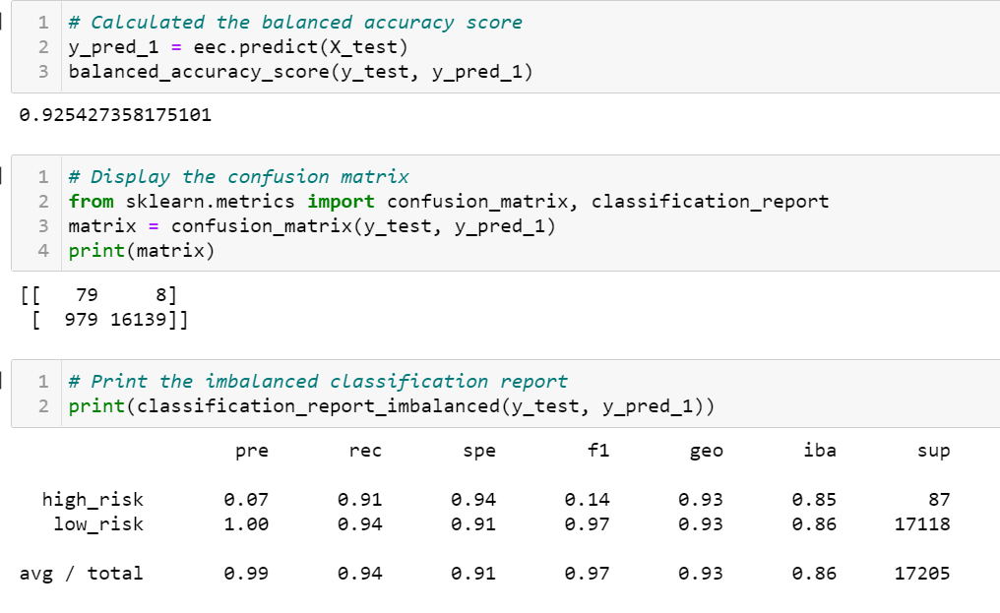

# Credit_Risk_Analysis
## Overview of the loan prediction risk analysis
The purpose of this challenge is to apply machine learning to solve a real-world challenge: **credit card risk.**
**Credit risk** is an inherently unbalanced classification problem, as good loans easily outnumber risky loans. Therefore different techniques to train and evaluate models with unbalanced classes need to be employed. Imbalanced-learn and scikit-learn libraries are used  to build and evaluate these  models using resampling.
 Here we oversample the data using the RandomOverSampler and SMOTE algorithms, and undersample the data using the ClusterCentroids algorithm. A combinatorial approach of over- and undersampling using the SMOTEENN algorithm is then employed  Next, a comparision of  two new machine learning models that reduce bias, BalancedRandomForestClassifier and EasyEnsembleClassifier, to predict credit risk is performed.
 
 ## RESULTS
 
 ### Credit Risk Resampling Techniques
 ### --Naive Random Oversampling
 
 
 
- *Balance accuracy score - 62%*
- Precision scores - high-risk 0.01 - low-risk 1.00
- Recall scores - high-risk 0.59 - low-risk 0.67
- avg/total- 99% for precision & 69% for sensitivity*
 
  
 ### --SMOTE_Oversampling
  
  
  
-*Balance accuracy score - 62%
-Precision scores - high-risk 0.01 - low-risk 1.00
-Recall scores - high-risk 0.61 - low-risk 0.64
-avg/total- 99% for precision & 64% for sensitivity*
 
 ### --Undersampling with Cluster Centroids algorithm
 
 
-*Balance accuracy score - 62%
-Precision scores - high-risk 0.01 - low-risk 1.00
-Recall scores - high-risk 0.59 - low-risk 0.43
-avg/total- 99% for precision & 44% for sensitivity*
 
 
 
 ### --Combination (Over and Under) Sampling
 
-*Balance accuracy score - 62%
-Precision scores - high-risk 0.01 - low-risk 1.00
-Recall scores - high-risk 0.70 - low-risk 0.57
-avg/total- 99% for precision & 57% for sensitivity*
 
 ### --Balanced_Random_Forest_Classifier

-*Balance accuracy score - 78%
-Precision scores - high-risk 0.04 - low-risk 1.00
-Recall scores - high-risk 0.67 - low-risk 0.91

### Easy Ensemble AdaBoost Classifier

-*Balance accuracy score - 92%
-Precision scores - high-risk 0.07 - low-risk 1.00
-Recall scores - high-risk 0.91 - low-risk 0.94
-avg/total- 99% for precision & 94% for sensitivity*

## SUMMARY

After performing all the analysis using different algorithms and sampling techniques, for credit risk analysis Easy AdaBoost Classifier is the best  model to be used.
It has given a 92% balanced accuracy score test compared to other model whose scores ranged from 62-78% approx.The F1 score for Adboost is 97% showing a goob balance between 
precision and sensitivity. Credit Card risk model needs to focus more on the sensitivity of the model which was 94 %  as Faslse Positives can be ruled out !
