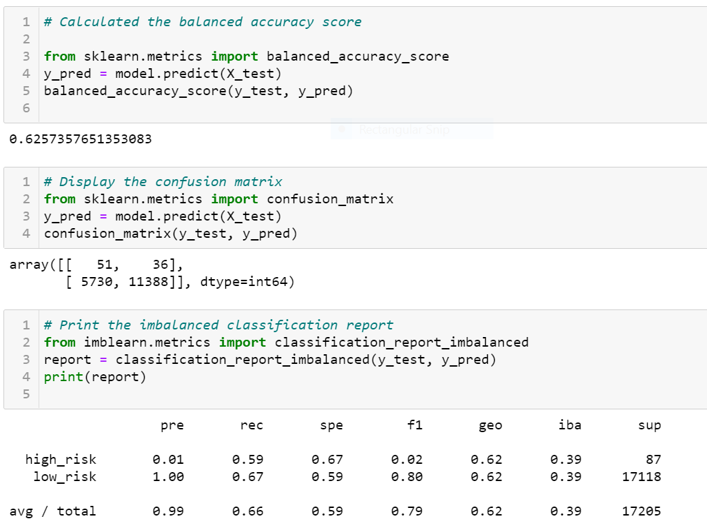
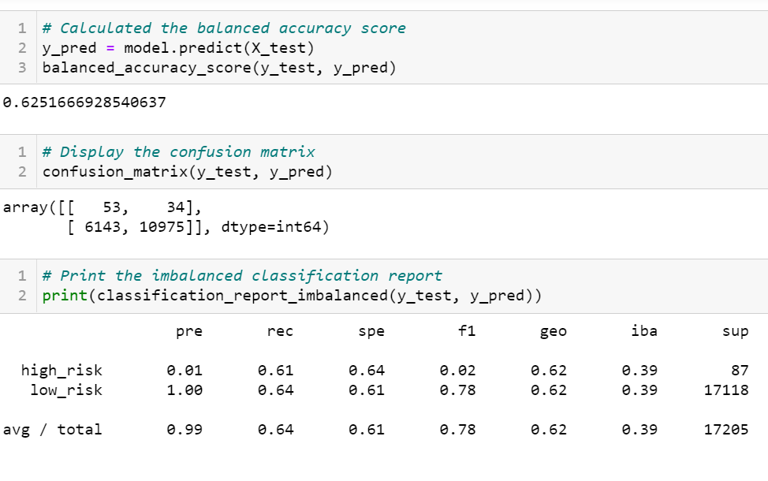
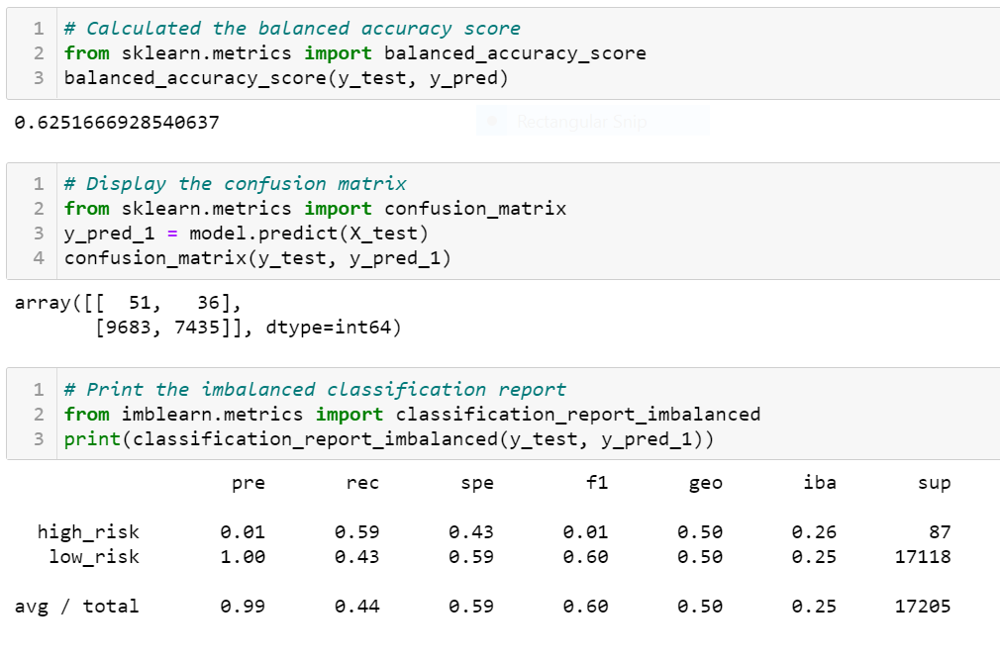
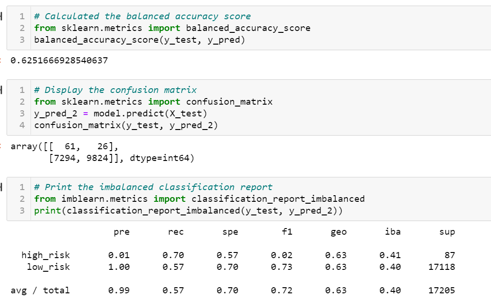
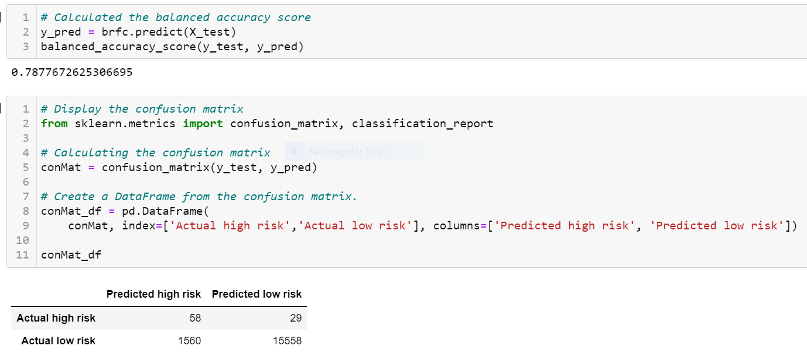
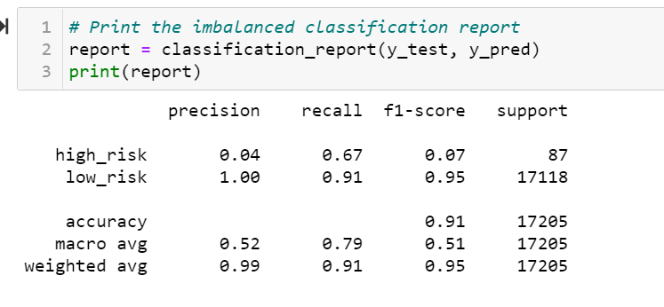

# Credit_Risk_Analysis
## Overview of the loan prediction risk analysis
The purpose of this challenge is to apply machine learning to solve a real-world challenge: **credit card risk.**
**Credit risk** is an inherently unbalanced classification problem, as good loans easily outnumber risky loans. Therefore different techniques to train and evaluate models with unbalanced classes need to be employed. Imbalanced-learn and scikit-learn libraries are used  to build and evaluate these  models using resampling.
 Here we oversample the data using the RandomOverSampler and SMOTE algorithms, and undersample the data using the ClusterCentroids algorithm. A combinatorial approach of over- and undersampling using the SMOTEENN algorithm is then employed  Next, a comparision of  two new machine learning models that reduce bias, BalancedRandomForestClassifier and EasyEnsembleClassifier, to predict credit risk is performed.
 
 ## RESULTS
 
 ### Credit Risk Resampling Techniques
 ### --Naive Random Oversampling
 
 
 
  
 ### --SMOTE_Oversampling
  
  
 
 ### --Undersampling with Cluster Centroids algorithm
 
 
 
 
 ### --Combination (Over and Under) Sampling
 
 
 ### --Balanced_Random_Forest_Classifier

